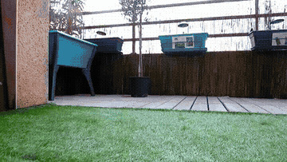

# Travaux pratiques

Les TP mettent en pratique les notions du cours sur un système réel. La vidéo
ci-dessous montre un robot LEGO qui réalise de manière autonome une
stabilisation :

[Regarder ou télécharger la vidéo MP4 sans son](../cours/videos/robot-lego.mp4)

Les supports et fichiers de TP seront ajoutés dans ce répertoire ou sur Moodle
lorsqu'ils seront disponibles.
